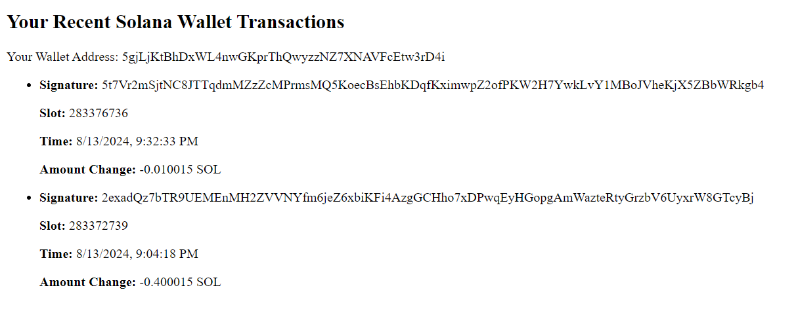

# Solana Wallet Transaction
I created this app using React for participating in 100x Dev's Solana HAckathon. So, basically it's my hackathon project. 
 
I haven't any idea of Solana, Web3 or Blockchain but on the last video of Harkirat Singh. He told to Samay Raina that, if someone will make this (Solana Wallet Trasaction) project, atleast he can win $50. So, for that $50, I created this, with the help of AI.

## Screenshot : 

## Packages you need to install first : 
### `npm install react`
### `npm install @solana/web3.js`

## Available Scripts

In the project directory, you can run:

### `npm start`

Runs the app in the development mode.\
Open [http://localhost:3000](http://localhost:3000) to view it in your browser.

The page will reload when you make changes.\
You may also see any lint errors in the console.

### `npm test`

Launches the test runner in the interactive watch mode.\
See the section about [running tests](https://facebook.github.io/create-react-app/docs/running-tests) for more information.

### `npm run build`

Builds the app for production to the `build` folder.\
It correctly bundles React in production mode and optimizes the build for the best performance.

The build is minified and the filenames include the hashes.\
Your app is ready to be deployed!

See the section about [deployment](https://facebook.github.io/create-react-app/docs/deployment) for more information.

### `npm run eject`

**Note: this is a one-way operation. Once you `eject`, you can't go back!**

